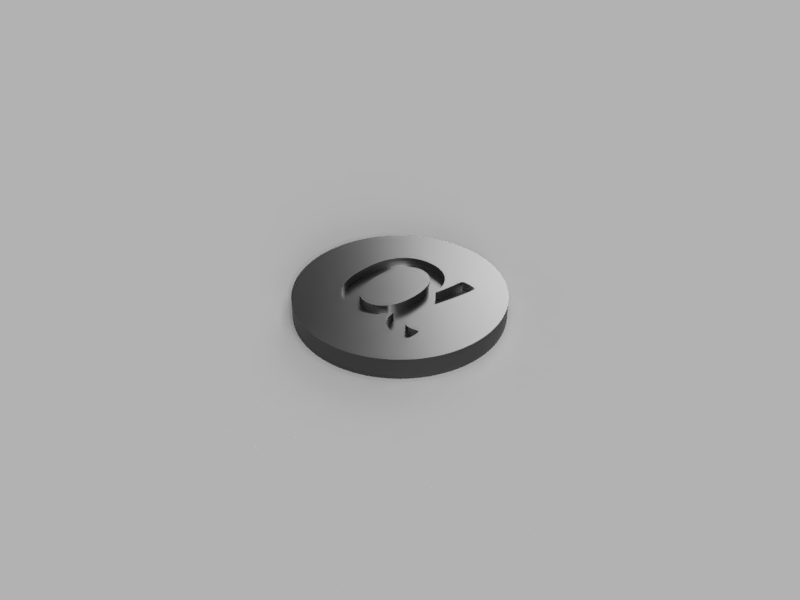

# Jeton de charriot "Agora"

## Le matériel / Les logiciels
* Une imprimante 3D
* Inkscape - logiciel de dessin vectoriel
* Autodesk Fusion 360 - logiciel de CAO
* Cura - logiciel de préparation pour l'impression

**Astuce :** si vous n'avez pas Fusion 360, vous pouvez utiliser d'autres logiciels gratuits. Mes choix se porteraient sur : OpenSCAD, FreeCAD ou Blender. 

## Réalisation 

### Etape 1 - Préparer le dessin

Pour préparer le dessin, j'utilise Inkscape. Pour utiliser le résultat dans Fusion 360, j'exporte le résultat en DXF. Le DXF fonctionne aussi avec OpenSCAD.

[Télécharger le fichier svg](https://raw.githubusercontent.com/ItHasU/AtelierAgora/master/jeton/alpha.svg)

### Etape 2 - Créer le modèle 3D

Dans Fusion 360 j'extrude un rond pour faire le contour et je creuse le motif. Voici le résultat.

[Télécharger le fichier STL](https://github.com/ItHasU/AtelierAgora/blob/master/jeton/agora.stl)

### Etaape 3 - Impression

Pour préparer l'impression, nous utilisons le logiciel Cura d'Ultimaker. 
Nous avons une imprimante Ultimaker 2 GO, attention, en fonction de votre imprimante, vous ne pouvez pas utiliser le même GCode.

[Télécharger le GCode pour l'Ultimaker GO](https://raw.githubusercontent.com/ItHasU/AtelierAgora/master/jeton/UM2GO_agora.gcode)
